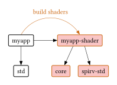
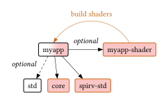

# Crate structure

As discussed in the introduction, you need to split your codebase in two: Your shaders and your CPU code. This article will discuss some common crate structures and what advantages and disadvantages they have. And link to the subarticles explaining in detail how to set them up yourself. For the more advanced use cases, it will also give you some background on why a certain structure was chosen, and what potential issues to look out for. We recommend reading this article from the top as the simpler setups will cover the basics, which some of the more advanced setups further down rely upon.

## *Recommended:* Separate shader crate

You have two different crates:
* A "main crate" with your CPU code that has access to all of rust `std`
* A `#[no-std]` "shader crate" that only has `core`

The graph above illustrates the crates as a graph, with the black arrows indicating dependencies. The `myapp` crate in the top left is your main crate and has access to all of rust's `std`, as you are used to from usual app development. Just right of it is your `myapp-shader` crate, where you will be placing your shaders within. Note the red background of the crate, indicating that this crate is a `#[no-std]` crate and only has access to the `core` subset of rust's standard library. This is not just true for the shader crate itself, but any of its dependencies must be `#[no-std]` as well, like the `spirv-std` library also colored in red. We'll discuss how to add [foreign crates](foreign-crates.md) with `#[no-std]` support later.

Notice how there's two different arrows going from your `myapp` crate to the `myapp-shaders` crate. First there is the black arrow indicating a direct dependency from your main crate onto your shader crate, giving it access to all the public symbols you defined within it. You can just use any structs or call any functions you defined from the CPU as if they're regular rust structs and functions, though intrinsics in `spirv-std` will panic. So any algorithms and data structures that should be shared between your CPU and shader code should be put into the shader crate.

While that dependency does give you access to the shader functions, and you may call them on the CPU, it doesn't turn them into *actual* shader binaries you can submit to your graphics API. There are many options on how to compile your shader crate into a shader binary, discussed in detail in [Rust-GPU setup](rust-gpu.md) later, but by far the most common one is to compile your shaders within the `build.rs` build script of your main crate. You then may include the shader binaries with `include_bytes!` into your binary or read them from the file at runtime, however you like.

**Advantages:**
* Creates a clean separation between `#[no-std]` "shader code" and `std` "CPU code". 
* Fewer accidental breakages from accidentally importing an `std` symbol instead of a `core` one.

Continue at the [setup guide here](crate-shader.md).

## Same crate

You want to have everything in the same crate. This is potentially useful if you have macros generating shader entry points automatically within otherwise std code. As the rust-gpu codegen backend can't compile rust's `std`, you will need to feature gate every use of std, typically by having an `std` feature in your crate.  

TODO graph description, optional crates, why shader crate, inverse arrow for building shaders

TODO I hate the crate name "myapp-shader" since it technically doesn't contain any shader

